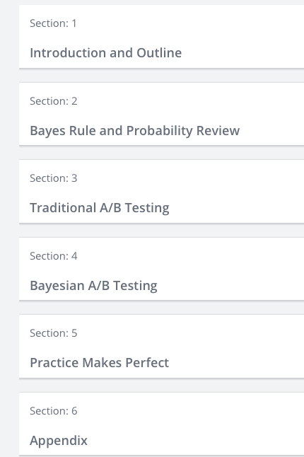

# Bayesian Machine Learning in Python A/B Testing

Bayesian Machine Learning in Python: A/B Testing; 

My notes for the Udemy course from Lazy Programmer Inc. (Data scientist and big data engineer). 
*** These are just my personal notes, if you want to learn about Bayesian Machine Learning in Python A/B Testing 
please buy the course or use other resources ***
Additional comment: some presented material is not in the mentioned course and of course not all 
course material is covered in the notes.

1 - Bayes Rule and Probability review  [link](https://github.com/tpalczew/Bayesian-Machine-Learning-in-Python-A-B-Testing/blob/master/1%20-%20Bayes_Rule_and_Probability_review.ipynb)

2 - 

Course Content:

Link to the course:

https://www.udemy.com/bayesian-machine-learning-in-python-ab-testing/

